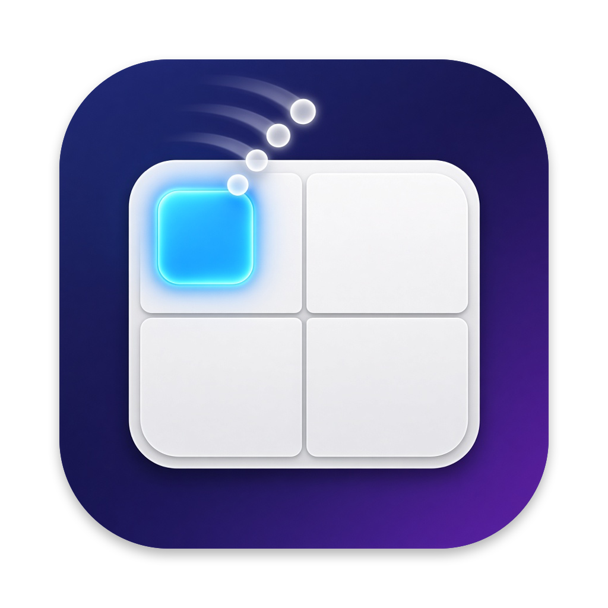

<p align="center">
  
</p>

# TrackTile

Snap macOS windows into halves, quarters, the center, or the full screen with a
three- or four-finger trackpad swipe. TrackTile runs in the menu bar and can show
a live outline of where the window will land while you swipe.

## Install

Download `TrackTile-<version>.zip` from the
[latest release](https://github.com/djui/tracktile/releases/latest), unzip it,
and move `TrackTile.app` to `/Applications`.

Releases built without a Developer ID certificate are not notarized. If macOS
refuses to open the app, right-click it and choose **Open**, or run
`xattr -dr com.apple.quarantine /Applications/TrackTile.app`.

## Menu bar icon and Settings

The menu bar icon gives you the on/off switch, Settings, About, and Quit. You
can hide it in Settings > General. With the icon hidden, open TrackTile again
from Finder, Spotlight, or Launchpad while it's running: that brings up the
Settings window, which also has About and Quit buttons.

## How the gesture works

The trackpad acts as a mini-map of the screen. Put three or four fingers
anywhere on the trackpad while the pointer is over a window, then slide toward
the part of the trackpad that matches where the window should go:

```
+-------------+-------------+-------------+
|  top left   |  top half   |  top right  |
+-------------+-------------+-------------+
|  left half  |   center    | right half  |
+-------------+-------------+-------------+
| bottom left | bottom half | bottom right|
+-------------+-------------+-------------+
        flick upward quickly: fill screen
```

Lift your fingers to snap. To cancel, slide back to where you started, add
another finger, or press Esc.

TrackTile acts on the window under the pointer when the swipe starts, and uses
the display the pointer is on. Windows in native full screen and windows that
refuse to move are skipped with a short red shake. Windows that can't be
resized can only be centered.

## Requirements

- macOS 15 or later
- Xcode 16 or later (Swift 6)
- A built-in trackpad or a Magic Trackpad

## Build and run

The Swift package lives in `TrackTile/`:

```sh
cd TrackTile
./scripts/bundle.sh
open build/TrackTile.app
```

`bundle.sh` builds a universal (Apple silicon and Intel) release binary,
assembles `build/TrackTile.app`, and signs it. To choose the certificate, set
`CODESIGN_IDENTITY`. Without it, the script uses the first "Developer ID
Application" or "Apple Development" identity in your keychain, and falls back
to ad-hoc signing.

Move the app to `/Applications` if you want "Launch at login" to work reliably.

Run the tests with:

```sh
cd TrackTile
swift test
```

## Releasing

`scripts/release.sh <version>` builds the app with that version and writes
`build/TrackTile-<version>.zip` plus a `.sha256` file, ready to attach to a
GitHub release. When `NOTARY_PROFILE` names a `notarytool` keychain profile and
the app is signed with Developer ID, the script also notarizes and staples it.

Pushing a tag such as `v0.1.0` runs `.github/workflows/release.yml`, which tests,
builds, and publishes the GitHub release with the zip attached. The workflow
signs with Developer ID and notarizes when these repository secrets are set;
otherwise it publishes an ad-hoc signed build:

| Secret | Contents |
| --- | --- |
| `DEVELOPER_ID_P12` | Base64 of the exported Developer ID Application certificate (.p12) |
| `DEVELOPER_ID_P12_PASSWORD` | Password of that .p12 |
| `APPLE_ID`, `APPLE_TEAM_ID`, `APPLE_APP_PASSWORD` | Notarization credentials (app-specific password) |

## App icon

`TrackTile/Resources/AppIcon-source.png` is the original artwork.
`swift scripts/make-icon.swift` (run in `TrackTile/`) masks it to the macOS icon
grid and regenerates `AppIcon.png` and `AppIcon.icns`.

## Permissions

TrackTile needs **Accessibility** access to move other apps' windows. On first
launch macOS asks for it; you can also grant it in System Settings > Privacy &
Security > Accessibility. TrackTile starts listening as soon as access is
granted, without a restart.

macOS ties this permission to the app's code signature. Ad-hoc signed builds
get a new signature on every build, so you have to grant access again after
each rebuild. Sign with a stable identity (any Apple Development certificate
works) to avoid that. If a rebuilt app stops working, remove TrackTile from the
Accessibility list and add it again.

## Conflicts with system gestures

macOS uses the same swipes for its own features, and both fire at once when
they overlap:

| Fingers | macOS feature | Where to change it |
| --- | --- | --- |
| 3 | Three-finger drag | Accessibility > Pointer Control > Trackpad Options |
| 3 or 4 | Mission Control and App Exposé | Trackpad > More Gestures |
| 3 or 4 | Swipe between full-screen apps | Trackpad > More Gestures |

The **Gestures** tab in TrackTile's settings detects these conflicts for the
finger count you chose. TrackTile defaults to four fingers. A common setup is
to set the macOS gestures to three fingers, or turn them off, and keep
TrackTile on four.

## Settings

- **Swipe with:** three fingers, four fingers, or both.
- **Flick up to fill screen:** how fast the upward flick must be.
- **Show outline:** the live preview of the final position.
- **Gap between windows:** space between snapped windows and the screen edges.
- **Center:** keep the window's size, or resize it to a fraction of the screen.
- **Launch at login.**
- **Show menu bar icon.**

## How it's built

All paths are relative to `TrackTile/`.

- `Sources/CMultitouch`: a small C shim that loads Apple's private
  `MultitouchSupport.framework` with `dlopen` and exposes raw trackpad contacts.
- `Sources/TrackTileCore`: platform-independent logic with unit tests. It
  contains the gesture state machine (`GestureTracker`), the trackpad-to-zone
  mapping (`ZoneClassifier`), and the layout math (`SnapZone`).
- `Sources/TrackTile`: the SwiftUI menu bar app. It contains trackpad device
  handling, the Accessibility-based `WindowMover`, the outline overlay, and
  the Settings and About windows.

Because TrackTile uses a private framework and the Accessibility API, it can't
be sandboxed or distributed through the Mac App Store. Distribute it as a
Developer ID build instead.

## License

TrackTile is available under the [MIT License](LICENSE).
